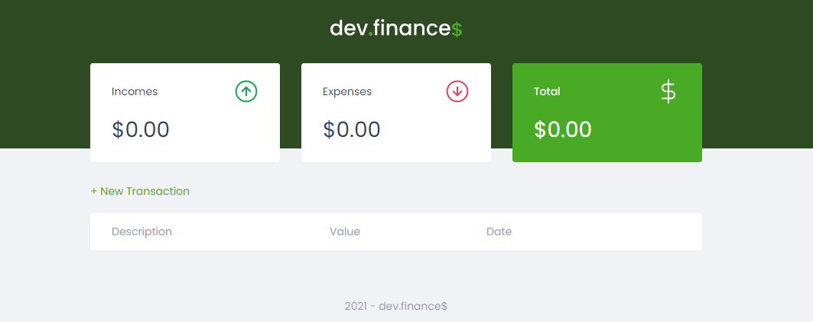

<h1 align="center">dev.finance$</h1>

<p align="center">
    <a href="#technologies">Technologies</a>&nbsp;&nbsp;|&nbsp;&nbsp;
    <a href="#project">Project</a>&nbsp;&nbsp;|&nbsp;&nbsp;
    <a href="#how-to-run">How to run</a>&nbsp;&nbsp;|&nbsp;&nbsp;
    <a href="#license">License</a>
</p>

<p align="center">
    
</p>

<br>

<p align="center">
    
</p>

## Technologies

This project was developed with the following technologies:

- HTML
- CSS
- JavaScript

## Project

Front-end development from a finance website where you can manage your incomes and expenses adding or deleting transactions.

## How to run

### Locally

- Clone the repository
```bash
git clone https://github.com/erickmp07/dev-finances.git
```
- Open the [`index.html`](index.html) file with a browser.

<br>

### Docker container

Prerequisites:

Download and install [Docker](https://www.docker.com/products/docker-desktop).

<br>

- Pull the image with the command:
```bash
docker pull erickmp07/dev-finances:latest
```

- Run the image with the command:
```bash
docker run -p 8080:80 -d erickmp07/dev-finances
```

<br>

The application can be accessed at [`localhost:8080`](http://localhost:8080).

## License

Licensed under [MIT](LICENSE) license.